# ACROSS THE AGES

Accross the Ages is an online E-Commerce store that specilizes in all things 90's and 2000's. The website is aimed at people who want to relive their child hood by wearing fashin from the decade and also purchasing toys and furniture they might have had in their houses while growing up.


## Am I resonsive image
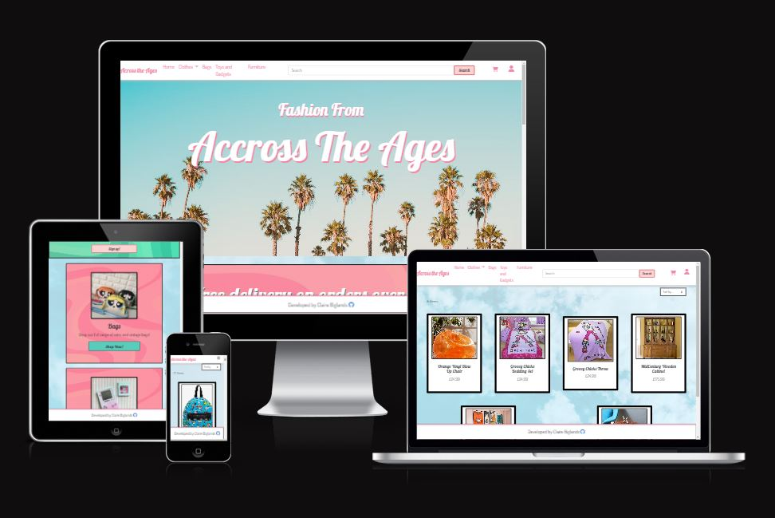


## UX

Because the website specializes in items from the 90's and 2000's I wanted the style of the website to reflect this. For the product card design I styled them after polaroid photos to give them a retro feel. 

I wanted to in corporate some funky bold backgrounds into the websites similar to those that we popular in the 70's but I didnt want them to be over powering and off putting so I decided to add them to the card and banner backgrounds and keep the rest of the page design simple and plain so that the over all effect wasnt too intense.


### Colour Scheme

The main colours scheme of the website is pink, blue, white with some green accents. I have used the same borders throughout the site to help make it feel more cohesive.

Main colours used throughout the website


### Typography

Throughout the site I use two main fonts, one for the page titles and one for the rest of the text. For the title fonts I chose a more playful cursive font to capture the users attention and then for the main text I used a simple clean font so that it was easy to read.

#### Title Fonts


#### Paragraph Fonts

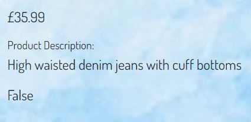

#### Icons

- [Font Awesome](https://fontawesome.com) icons were used throughout the site, for the user account icons and also the shopping cart icon.


## User Stories

- As a user I want to be able to view product 
- As a user I want to be able to search products
- As a user I want to be able to add items to my bag      
- As a user I want to be able create a profile
- As a user I want to be able to view purcahse history
- As a user I want to be able to view suggested products
- As a user I want to be able to checkout 
- As a user I want to be update shopping cart
- As a user I want to be remove items from shopping cart
- As a user I want to be able to save shipping information

## Wireframes

For the design of my app I used wireframes to visulize what I wanted each page to contain and a rough guide for how I wanted it to be laid out, this ensured that not only did I include all the features I wanted but also that i wasnt trying to design and create the website at the same time. 

### Home Page Wireframes

| Page                 | Screenshot                                                   |
| ---                  | ---                                                          |
| Homepage             | 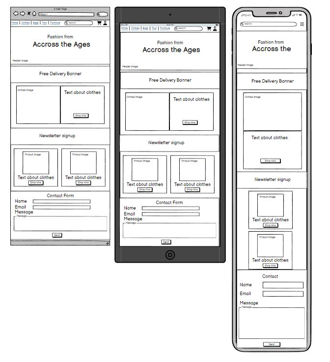 |
| Product Results Page | 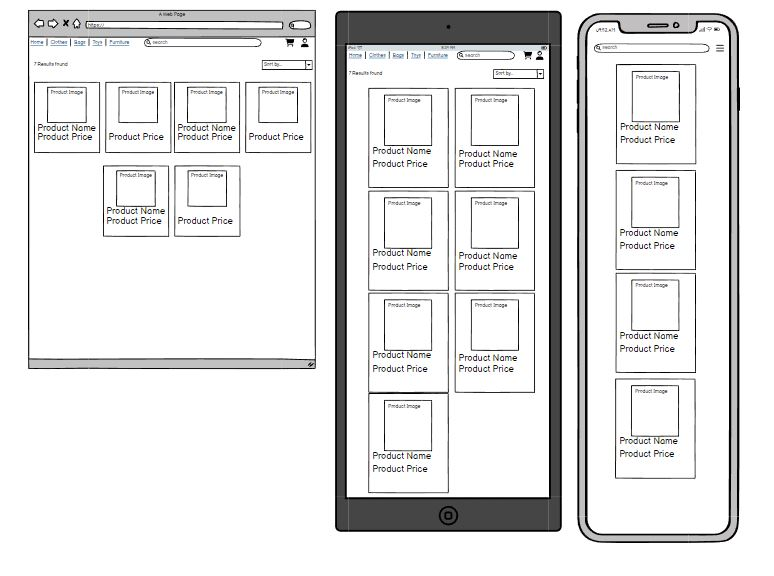 |
| Product View Page    | 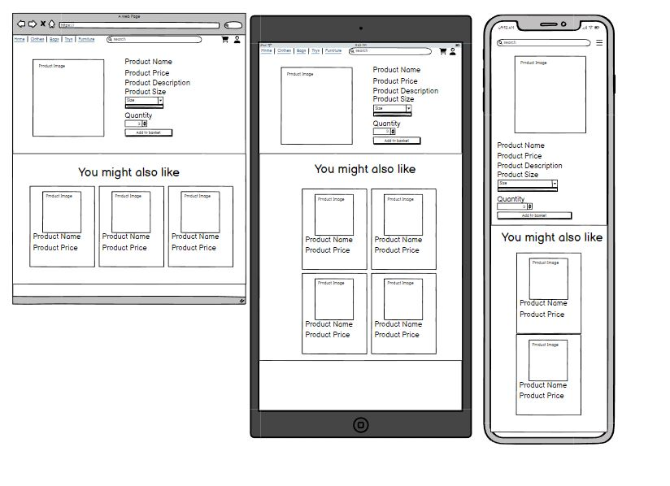 |
| Shopping Bag         | 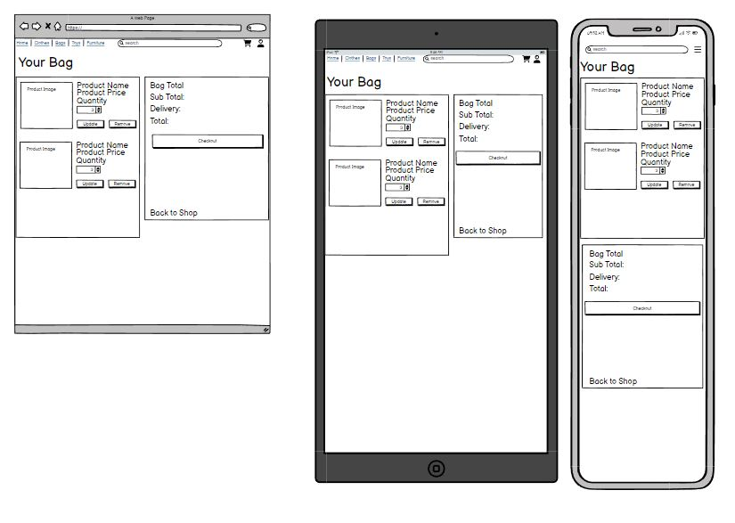 |
| Checkout Page        | 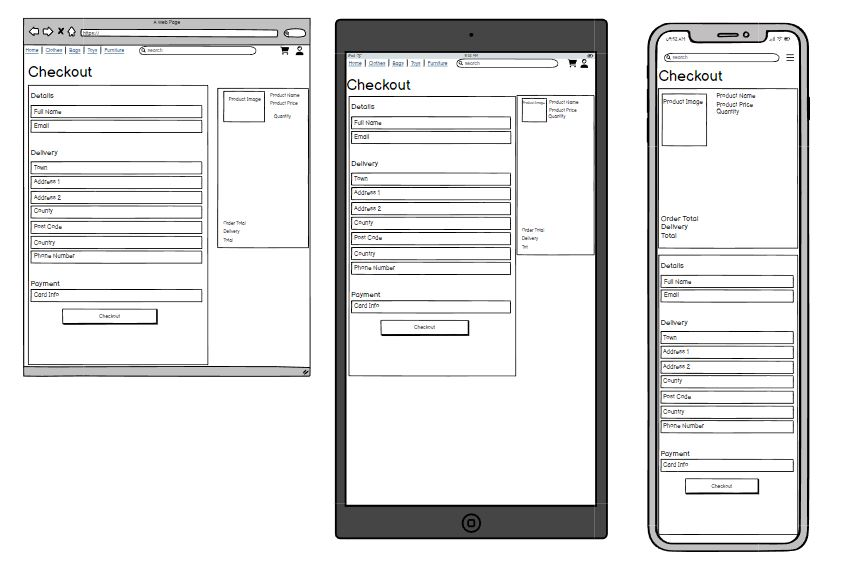 |
| Login Page           | 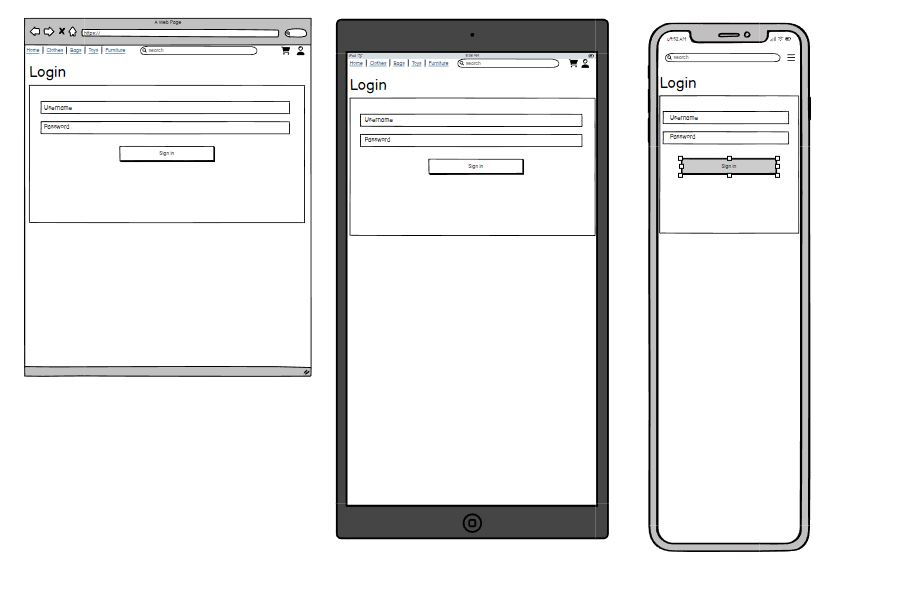 |
| Register Page        | 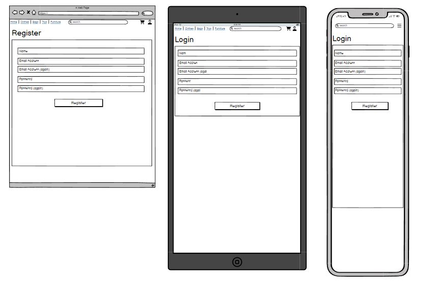 |


## Features

For this prodject the main features I wanted to implement was for the user to be able to view items then add them to the cart and succesfully checkout.
There were also a number of smaller features that I wanted to include that I felt would make the website better so I included a feature so when a user clicks on an item there is a section that shows the user other similar items that they might like. I also implemented a search feature so that if the user knew what product they were looking for they can easily search it rather then going through all of the listings trying to find it.
There is also an admin features that allows you to add, edit and remove products as long as you are signed in with a super user account. 

### Existing Features

#### Navbar

Since my website doesnt have many pages I wanted the navbar to be kept pretty basic and simple. On the left I have the app name with the different product categories, and then on the right the icons for for shopping cart and user profile. I also included a search bar in my navbar so at any point the user can search for a specific product rather then navigating through the product link pages. I added a simple hover effect to each of the links so that the user knows what area they are currently hovering over.

 

#### Search Bar
I wanted to include a search bar on the site because there are a lot of products included and I wanted to make is as easy as possible for the user to find what they were looking for. If the user knew what they wanted such as they want black shoes or a care bear bag I wanted them to be able to search for those terms rather than having to go to the shoe section and then looking through them all for black shoes or going to the bags and searching through all the products to find care bear ones. 

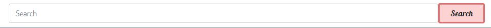 

#### Similar products
I included a similar products section because I thought it would be a good way to show the users products that they might also like depending on what they were currently looking at. I also thought it would be a good way for users to discover products that they might like but hadnt thought of looking at or searching for.

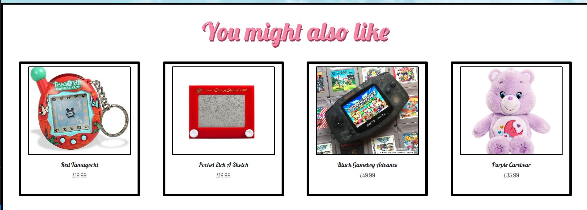 

#### Add products
I wanted a quick and easy way for the admin users to add new products to the page without having to go to the specific admin page and adding them that way so under their profile they have a product management section where they can add new products

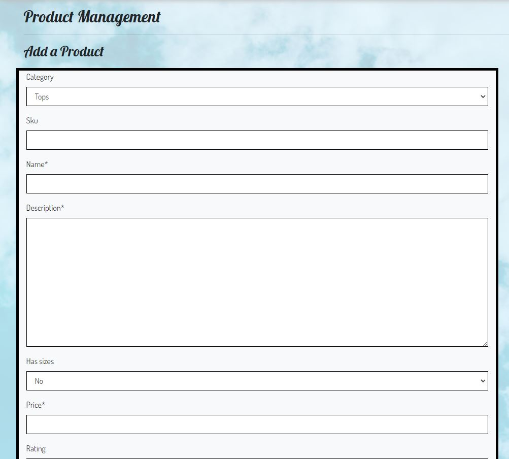 

#### Delete products
I wanted it to be super easy for the user to delete product so the user can remove products in two places one is under the prodcut result page, so if a user searches a product or if they click on a category they will have the option of removing the product in this view. 

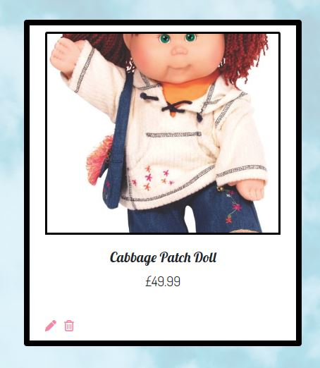 

They also have the option of removing the product from the product details view. 
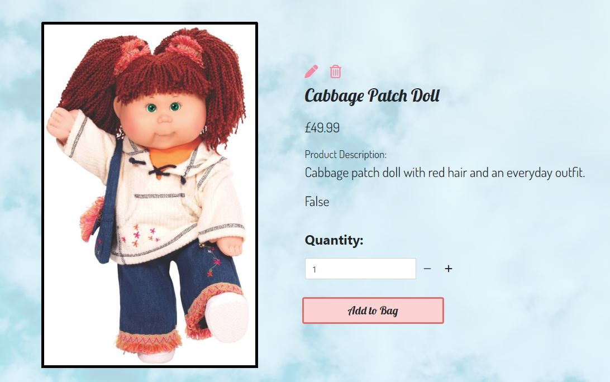 

#### Edit products
I wanted it to be super easy for the user to edit products so the user can remove products in two places one is under the prodcut result page, so if a user searches a product or if they click on a category they will have the option of editing the product in this view. 

 


They also have the option of editing the product from the product details view. 
 

Once the user clicks on the edit product icon it will bring them to a form which will be auto filled with the current product information, here they can edit the product and then once they click save it will be updated to the live site
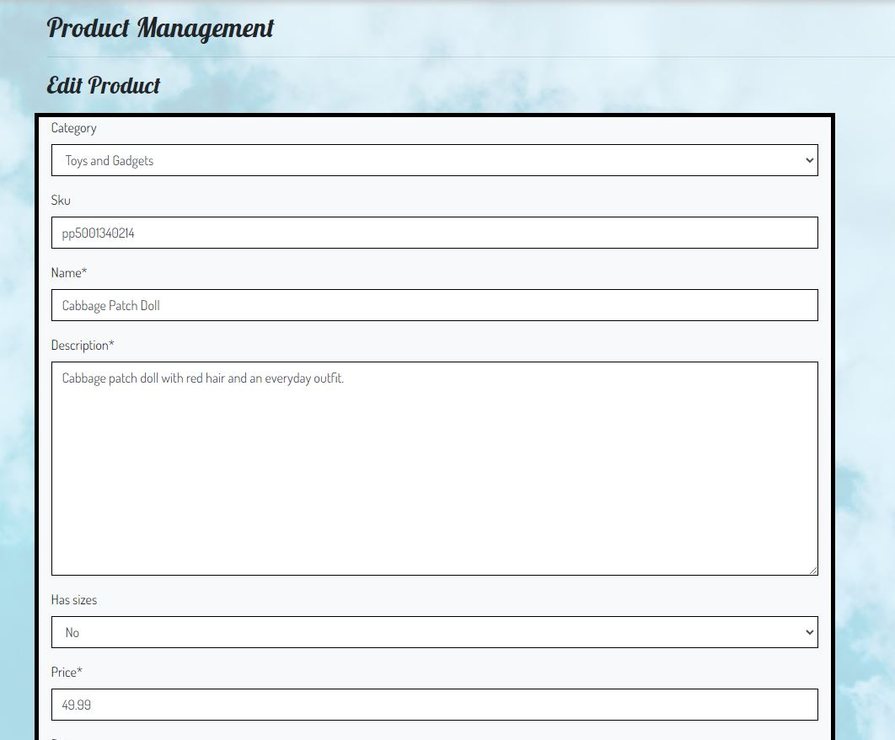 

#### Button Hovers
For the buttons throughout the website I wanted to add a hover effect so that the user could easily tell when they were hovering over a button.

Button before hover 
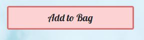

Button when user is hovering over it
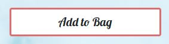 

#### Login page
Becuase users can create profiles that will store their delivery information and past orders I needed to include a login page so that they are able to access their accounts
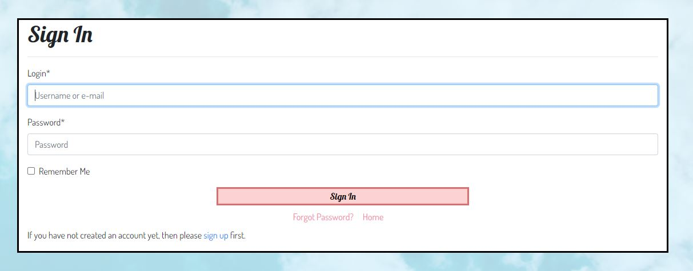 

#### Sign up Page
I created a signup page so that users can create an account if they would like
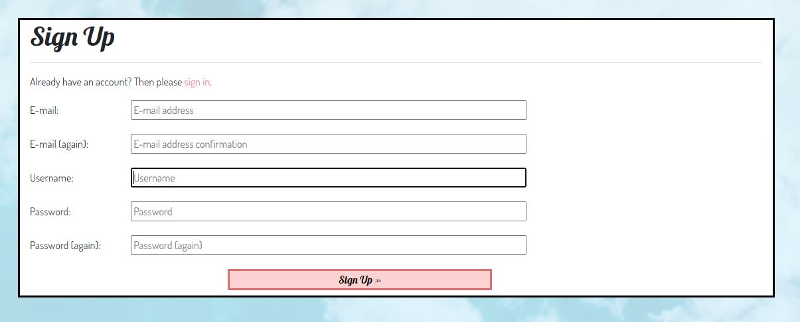 

#### Profile Page
For the profile page I wanted to include both the users delivery information so that they can easily update and edit it and also a list of all their past orders incase they want to refer back to it at any point.
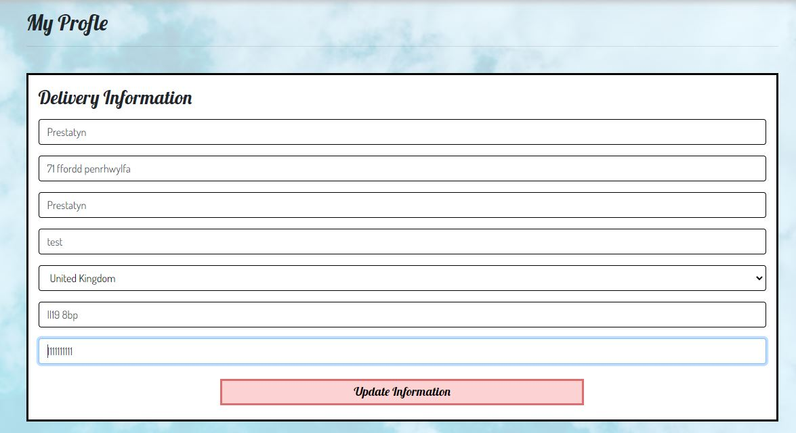 
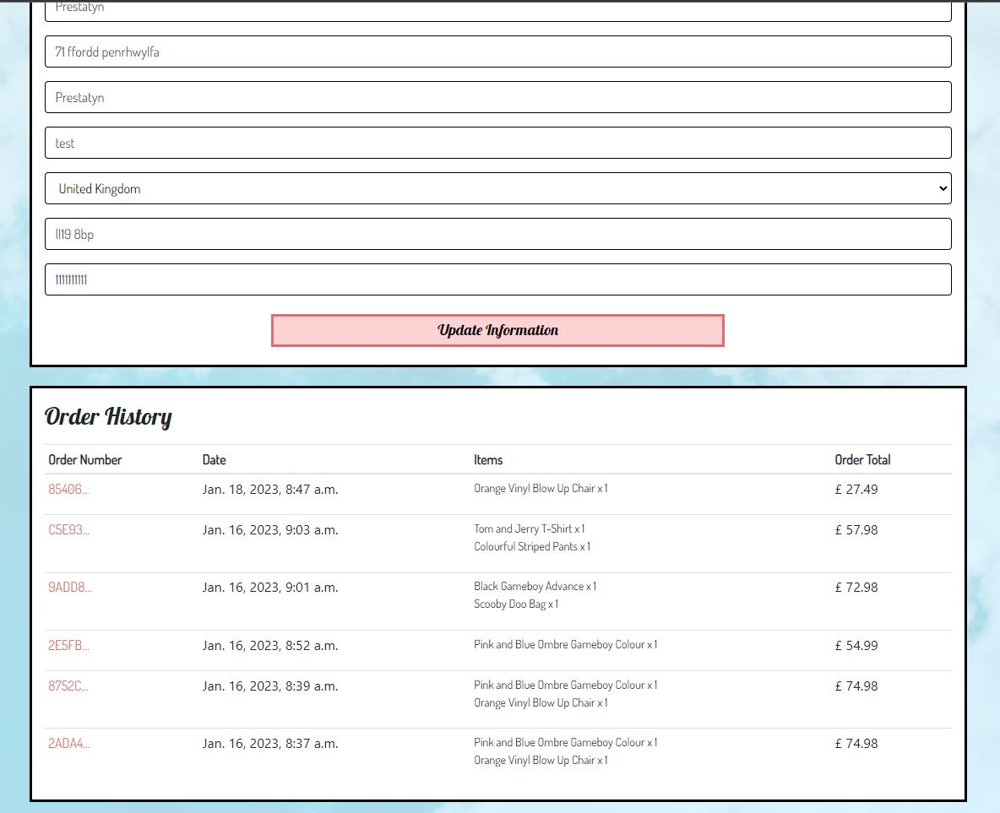 


## Tools & Technologies Used
    
Throughout the project I used a variety of technologies.
- I used HTML for the main site content [HTML](https://en.wikipedia.org/wiki/HTML) .
- I used CSS for the main site design and layout [CSS](https://en.wikipedia.org/wiki/CSS).
- I used Botstrap as the front-end CSS framework [Bootstrap](https://getbootstrap.com) 
- I used Balsamiq to design my wireframes [Balsamiq Website](https://balsamiq.com/)
- I used Python for the backend language [Python](https://www.python.org) 
- I used JavaScript for the front end programing language [JavaScript](https://www.javascript.com)
- I used Django as my templating language.[Django Website](https://www.djangoproject.com/)
- I used Stripe as the payment system.[Stripe Website](https://stripe.com/gb)
- I used AWS S3 for the online static file storage [AWS S3](https://aws.amazon.com/s3)
- I used github to create a repository for my project.[Github Website](https://github.com/)
- I used gitpod as the development environment.[Gitpod Website](https://gitpod.io/)
- I used Heroku to host my website [Heroku Website](https://dashboard.heroku.com/)
- I used ElephantSQL as the Postgres database [ElephantSQL](https://www.elephantsql.com)
- I used a markdown builder created by Tim Nelson to generate the Markdown file template [Markdown Builder by Tim Nelson](https://traveltimn.github.io/markdown-builder)


## Database Design

Entity Relationship Diagrams (ERD) help to visualize database architecture before creating models.
Understanding the relationships between different tables can save time later in the project.

Using your defined models (one example below), create an ERD with the relationships identified.

```python
class Product(models.Model):
    category = models.ForeignKey(
        "Category", null=True, blank=True, on_delete=models.SET_NULL)
    sku = models.CharField(max_length=254, null=True, blank=True)
    name = models.CharField(max_length=254)
    description = models.TextField()
    has_sizes = models.BooleanField(default=False, null=True, blank=True)
    price = models.DecimalField(max_digits=6, decimal_places=2)
    rating = models.DecimalField(
        max_digits=6, decimal_places=2, null=True, blank=True)
    image_url = models.URLField(max_length=1024, null=True, blank=True)
    image = models.ImageField(null=True, blank=True)

    def __str__(self):
        return self.name
```

A couple recommendations for building free ERDs:
- [Draw.io](https://draw.io)
- [Lucidchart](https://www.lucidchart.com/pages/ER-diagram-symbols-and-meaning)


Using Markdown formatting to represent an example ERD table using the Product model above:

- Table: **Product**

    | **PK** | **id** (unique) | Type | Notes |
    | --- | --- | --- | --- |
    | **FK** | category | ForeignKey | FK to **Category** model |
    | | sku | CharField | |
    | | name | CharField | |
    | | description | TextField | |
    | | has_sizes | BooleanField | |
    | | price | DecimalField | |
    | | rating | DecimalField | |
    | | image_url | URLField | |
    | | image | ImageField | |

## Testing

For all testing, please refer to the [TESTING.md](TESTING.md) file.

## Deployment

The live deployed application can be found deployed on [Heroku](https://across-the-ages.herokuapp.com).

### ElephantSQL Database

This project uses [ElephantSQL](https://www.elephantsql.com) for the PostgreSQL Database.

To obtain your own Postgres Database, sign-up with your GitHub account, then follow these steps:
- Click **Create New Instance** to start a new database.
- Provide a name (this is commonly the name of the project: Across-The-Ages).
- Select the **Tiny Turtle (Free)** plan.
- You can leave the **Tags** blank.
- Select the **Region** and **Data Center** closest to you.
- Once created, click on the new database name, where you can view the database URL and Password.

### Amazon AWS

This project uses [AWS](https://aws.amazon.com) to store media and static files online, due to the fact that Heroku doesn't persist this type of data.

Once you've created an AWS account and logged-in, follow these series of steps to get your project connected.
Make sure you're on the **AWS Management Console** page.

#### S3 Bucket

- Search for **S3**.
- Create a new bucket, give it a name (matching your Heroku app name), and choose the region closest to you.
- Uncheck **Block all public access**, and acknowledge that the bucket will be public (required for it to work on Heroku).
- From **Object Ownership**, make sure to have **ACLs enabled**, and **Bucket owner preferred** selected.
- From the **Properties** tab, turn on static website hosting, and type `index.html` and `error.html` in their respective fields, then click **Save**.
- From the **Permissions** tab, paste in the following CORS configuration:

	```shell
	[
		{
			"AllowedHeaders": [
				"Authorization"
			],
			"AllowedMethods": [
				"GET"
			],
			"AllowedOrigins": [
				"*"
			],
			"ExposeHeaders": []
		}
	]
	```

- Copy your **ARN** string.
- From the **Bucket Policy** tab, select the **Policy Generator** link, and use the following steps:
	- Policy Type: **S3 Bucket Policy**
	- Effect: **Allow**
	- Principal: `*`
	- Actions: **GetObject**
	- Amazon Resource Name (ARN): **paste-your-ARN-here**
	- Click **Add Statement**
	- Click **Generate Policy**
	- Copy the entire Policy, and paste it into the **Bucket Policy Editor**

		```shell
		{
			"Id": "Policy1234567890",
			"Version": "2012-10-17",
			"Statement": [
				{
					"Sid": "Stmt1234567890",
					"Action": [
						"s3:GetObject"
					],
					"Effect": "Allow",
					"Resource": "arn:aws:s3:::your-bucket-name/*"
					"Principal": "*",
				}
			]
		}
		```

	- Before you click "Save", add `/*` to the end of the Resource key in the Bucket Policy Editor (like above).
	- Click **Save**.
- From the **Access Control List (ACL)** section, click "Edit" and enable **List** for **Everyone (public access)**, and accept the warning box.
	- If the edit button is disabled, you need to change the **Object Ownership** section above to **ACLs enabled** (mentioned above).

#### IAM

Back on the AWS Services Menu, search for and open **IAM** (Identity and Access Management).
Once on the IAM page, follow these steps:

- From **User Groups**, click **Create New Group**.
	- Suggested Name: `group-across-the-ages` (group + the project name)
- Tags are optional, but you must click it to get to the **review policy** page.
- From **User Groups**, select your newly created group, and go to the **Permissions** tab.
- Open the **Add Permissions** dropdown, and click **Attach Policies**.
- Select the policy, then click **Add Permissions** at the bottom when finished.
- From the **JSON** tab, select the **Import Managed Policy** link.
	- Search for **S3**, select the `AmazonS3FullAccess` policy, and then **Import**.
	- You'll need your ARN from the S3 Bucket copied again, which is pasted into "Resources" key on the Policy.

		```shell
		{
			"Version": "2012-10-17",
			"Statement": [
				{
					"Effect": "Allow",
					"Action": "s3:*",
					"Resource": [
						"arn:aws:s3:::your-bucket-name",
						"arn:aws:s3:::your-bucket-name/*"
					]
				}
			]
		}
		```
	
	- Click **Review Policy**.
	- Suggested Name: `policy-across-the-ages` (policy + the project name)
	- Provide a description:
		- "Access to S3 Bucket for across-the-ages static files."
	- Click **Create Policy**.
- From **User Groups**, click your "group-across-the-ages".
- Click **Attach Policy**.
- Search for the policy you've just created ("policy-across-the-ages") and select it, then **Attach Policy**.
- From **User Groups**, click **Add User**.
	- Suggested Name: `user-across-the-ages` (user + the project name)
- For "Select AWS Access Type", select **Programmatic Access**.
- Select the group to add your new user to: `group-across-the-ages`
- Tags are optional, but you must click it to get to the **review user** page.
- Click **Create User** once done.
- You should see a button to **Download .csv**, so click it to save a copy on your system.
	- **IMPORTANT**: once you pass this page, you cannot come back to download it again, so do it immediately!
	- This contains the user's **Access key ID** and **Secret access key**.
	- `AWS_ACCESS_KEY_ID` = **Access key ID**
	- `AWS_SECRET_ACCESS_KEY` = **Secret access key**

#### Final AWS Setup

- If Heroku Config Vars has `DISABLE_COLLECTSTATIC` still, this can be removed now, so that AWS will handle the static files.
- Back within **S3**, create a new folder called: `media`.
- Select any existing media images for your project to prepare them for being uploaded into the new folder.
- Under **Manage Public Permissions**, select **Grant public read access to this object(s)**.
- No further settings are required, so click **Upload**.

### Stripe API

This project uses [Stripe](https://stripe.com) to handle the ecommerce payments.

Once you've created a Stripe account and logged-in, follow these series of steps to get your project connected.

- From your Stripe dashboard, click to expand the "Get your test API keys".
- You'll have two keys here:
	- `STRIPE_PUBLIC_KEY` = Publishable Key (starts with **pk**)
	- `STRIPE_SECRET_KEY` = Secret Key (starts with **sk**)

As a backup, in case users prematurely close the purchase-order page during payment, we can include Stripe Webhooks.

- From your Stripe dashboard, click **Developers**, and select **Webhooks**.
- From there, click **Add Endpoint**.
	- `https://across-the-ages.herokuapp.com/checkout/wh/`
- Click **receive all events**.
- Click **Add Endpoint** to complete the process.
- You'll have a new key here:
	- `STRIPE_WH_SECRET` = Signing Secret (Wehbook) Key (starts with **wh**)

### Gmail API

This project uses [Gmail](https://mail.google.com) to handle sending emails to users for account verification and purchase order confirmations.

Once you've created a Gmail (Google) account and logged-in, follow these series of steps to get your project connected.

- Click on the **Account Settings** (cog icon) in the top-right corner of Gmail.
- Click on the **Accounts and Import** tab.
- Within the section called "Change account settings", click on the link for **Other Google Account settings**.
- From this new page, select **Security** on the left.
- Select **2-Step Verification** to turn it on. (verify your password and account)
- Once verified, select **Turn On** for 2FA.
- Navigate back to the **Security** page, and you'll see a new option called **App passwords**.
- This might prompt you once again to confirm your password and account.
- Select **Mail** for the app type.
- Select **Other (Custom name)** for the device type.
	- Any custom name, such as "Django" or Across-The-Ages
- You'll be provided with a 16-character password (API key).
	- Save this somewhere locally, as you cannot access this key again later!
	- `EMAIL_HOST_PASS` = your new 16-character API key
	- `EMAIL_HOST_USER` = your own personal Gmail email address (`you@gmail.com`)

### Heroku Deployment

This project uses [Heroku](https://www.heroku.com), a platform as a service (PaaS) that enables developers to build, run, and operate applications entirely in the cloud.

Deployment steps are as follows, after account setup:

- Select **New** in the top-right corner of your Heroku Dashboard, and select **Create new app** from the dropdown menu.
- Your app name must be unique, and then choose a region closest to you (EU or USA), and finally, select **Create App**.
- From the new app **Settings**, click **Reveal Config Vars**, and set your environment variables.

| Key | Value |
| --- | --- |
| `AWS_ACCESS_KEY_ID` | insert your own AWS Access Key ID key here |
| `AWS_SECRET_ACCESS_KEY` | insert your own AWS Secret Access key here |
| `DATABASE_URL` | insert your own ElephantSQL database URL here |
| `DISABLE_COLLECTSTATIC` | 1 (*this is temporary, and can be removed for the final deployment*) |
| `EMAIL_HOST_PASS` | insert your own Gmail API key here |
| `EMAIL_HOST_USER` | insert your own Gmail email address here |
| `SECRET_KEY` | this can be any random secret key |
| `STRIPE_PUBLIC_KEY` | insert your own Stripe Public API key here |
| `STRIPE_SECRET_KEY` | insert your own Stripe Secret API key here |
| `STRIPE_WH_SECRET` | insert your own Stripe Webhook API key here |
| `USE_AWS` | True |

Heroku needs two additional files in order to deploy properly.
- requirements.txt
- Procfile

You can install this project's **requirements** (where applicable) using:
- `pip3 install -r requirements.txt`

If you have your own packages that have been installed, then the requirements file needs updated using:
- `pip3 freeze --local > requirements.txt`

The **Procfile** can be created with the following command:
- `echo web: gunicorn app_name.wsgi > Procfile`
- *replace **app_name** with the name of your primary Django app name; the folder where settings.py is located*

For Heroku deployment, follow these steps to connect your own GitHub repository to the newly created app:

Either:
- Select **Automatic Deployment** from the Heroku app.

Or:
- In the Terminal/CLI, connect to Heroku using this command: `heroku login -i`
- Set the remote for Heroku: `heroku git:remote -a app_name` (replace *app_name* with your app name)
- After performing the standard Git `add`, `commit`, and `push` to GitHub, you can now type:
	- `git push heroku main`

The project should now be connected and deployed to Heroku!

### Local Deployment

This project can be cloned or forked in order to make a local copy on your own system.

For either method, you will need to install any applicable packages found within the *requirements.txt* file.
- `pip3 install -r requirements.txt`.

You will need to create a new file called `env.py` at the root-level,
and include the same environment variables listed above from the Heroku deployment steps.

Sample `env.py` file:

```python
import os

os.environ.setdefault("AWS_ACCESS_KEY_ID", "insert your own AWS Access Key ID key here")
os.environ.setdefault("AWS_SECRET_ACCESS_KEY", "insert your own AWS Secret Access key here")
os.environ.setdefault("DATABASE_URL", "insert your own ElephantSQL database URL here")
os.environ.setdefault("EMAIL_HOST_PASS", "insert your own Gmail API key here")
os.environ.setdefault("EMAIL_HOST_USER", "insert your own Gmail email address here")
os.environ.setdefault("SECRET_KEY", "this can be any random secret key")
os.environ.setdefault("STRIPE_PUBLIC_KEY", "insert your own Stripe Public API key here")
os.environ.setdefault("STRIPE_SECRET_KEY", "insert your own Stripe Secret API key here")
os.environ.setdefault("STRIPE_WH_SECRET", "insert your own Stripe Webhook API key here")

# local environment only (do not include these in production/deployment!)
os.environ.setdefault("DEBUG", "True")
```

Once the project is cloned or forked, in order to run it locally, you'll need to follow these steps:
- Start the Django app: `python3 manage.py runserver`
- Stop the app once it's loaded: `CTRL+C` or `⌘+C` (Mac)
- Make any necessary migrations: `python3 manage.py makemigrations`
- Migrate the data to the database: `python3 manage.py migrate`
- Create a superuser: `python3 manage.py createsuperuser`
- Load fixtures (if applicable): `python3 manage.py loaddata file-name.json` (repeat for each file)
- Everything should be ready now, so run the Django app again: `python3 manage.py runserver`

If you'd like to backup your database models, use the following command for each model you'd like to create a fixture for:
- `python3 manage.py dumpdata your-model > your-model.json`
- *repeat this action for each model you wish to backup*

#### Cloning

You can clone the repository by following these steps:

1. Go to the [GitHub repository](https://github.com/Claire221/Across-The-Ages) 
2. Locate the Code button above the list of files and click it 
3. Select if you prefer to clone using HTTPS, SSH, or GitHub CLI and click the copy button to copy the URL to your clipboard
4. Open Git Bash or Terminal
5. Change the current working directory to the one where you want the cloned directory
6. In your IDE Terminal, type the following command to clone my repository:
	- `git clone https://github.com/Claire221/Across-The-Ages.git`
7. Press Enter to create your local clone.

Alternatively, if using Gitpod, you can click below to create your own workspace using this repository.

[](https://gitpod.io/#https://github.com/Claire221/Across-The-Ages)

Please note that in order to directly open the project in Gitpod, you need to have the browser extension installed.
A tutorial on how to do that can be found [here](https://www.gitpod.io/docs/configure/user-settings/browser-extension).

#### Forking

By forking the GitHub Repository, we make a copy of the original repository on our GitHub account to view and/or make changes without affecting the original owner's repository.
You can fork this repository by using the following steps:

1. Log in to GitHub and locate the [GitHub Repository](https://github.com/Claire221/Across-The-Ages)
2. At the top of the Repository (not top of page) just above the "Settings" Button on the menu, locate the "Fork" Button.
3. Once clicked, you should now have a copy of the original repository in your own GitHub account!

### Local VS Deployment

Use this space to discuss any differences between the local version you've developed, and the live deployment site on Heroku.


### Media

#### Homepage Images
- Page Background [Unsplash](https://images.unsplash.com/photo-1529832393073-e362750f78b3?ixlib=rb-4.0.3&ixid=MnwxMjA3fDB8MHxwaG90by1wYWdlfHx8fGVufDB8fHx8&auto=format&fit=crop&w=1470&q=80)
- Homepage Header Background [Unsplash](https://images.unsplash.com/photo-1499561385668-5ebdb06a79bc?ixlib=rb-4.0.3&ixid=MnwxMjA3fDB8MHxwaG90by1wYWdlfHx8fGVufDB8fHx8&auto=format&fit=crop&w=1469&q=80)
- Homepage Banner Background [Google](https://static.displate.com/857x1200/displate/2021-08-02/b101ad1607c40df7bfffa2b691471cc2_986d362de5e7937935734268606f33ce.jpg)
- Homepage Banner Background 02 [freepik](https://img.freepik.com/premium-vector/green-groovy-background-retro-background_47435-383.jpg?w=2000)
- Contact Form [freepik](https://img.freepik.com/vector-premium/patron-retro-estilo-anos-70-60-flores-colores-fondo-vintage-retro-floral-flor-ranura_511024-1105.jpg?w=360)

#### Product Images
- Product 02 [Image](https://i.pinimg.com/564x/40/23/00/402300ff23ce0a4a771d5627a8b6295a.jpg)
- Product 01 [Image](https://i.pinimg.com/564x/1e/4e/ae/1e4eaeabf7e3198138164dfc3db02bfb.jpg)
- Product 03 [Image](https://i.pinimg.com/564x/97/99/c4/9799c40e838838821a8f0ad96a630005.jpg)
- Product 04 [Image](https://i.pinimg.com/564x/eb/08/f9/eb08f96165b2c7314474bd6dfee141a7.jpg)
- Product 05 [Image](https://i.pinimg.com/564x/97/dd/da/97ddda0ca53c995107ce7822c357067c.jpg)
- Product 06 [Image](https://i.pinimg.com/564x/fe/85/f7/fe85f70960cf87fb14b9b3fd9dfdd450.jpg)
- Product 07 [Image](https://i.pinimg.com/564x/b9/84/37/b98437e194afa74c6c2c0580791b69c0.jpg)
- Product 08 [Image](https://i.pinimg.com/564x/e9/c9/ef/e9c9ef93314f1bfa92dd280303ba04e6.jpg)
- Product 09 [Image](https://i.pinimg.com/564x/ea/3a/c1/ea3ac17612aaec0b901b84dae4d2d9ca.jpg)
- Product 10 [Image](https://i.pinimg.com/564x/72/87/b5/7287b5a2259dafd3daf05b5409f1cc30.jpg)
- Product 11 [Image](https://i.pinimg.com/564x/d7/b1/94/d7b194d3a4732cc8e8dc959db91ee71b.jpg)
- Product 12 [Image](https://i.pinimg.com/564x/ec/d6/24/ecd62471211c81c3b0f150460e6eea19.jpg)
- Product 13 [Image](https://i.pinimg.com/564x/31/f8/01/31f80187382d6c381d27b7afb581799f.jpg)
- Product 14 [Image](https://i.pinimg.com/564x/7b/38/54/7b38541467dc0a498ec2229376725518.jpg)
- Product 15 [Image](https://i.pinimg.com/564x/fd/bc/32/fdbc327ec419f2b5ac03f8a50a289914.jpg)
- Product 16 [Image](https://i.pinimg.com/564x/99/3e/7c/993e7ce629530468709649261805019a.jpg)
- Product 17 [Image](https://i.pinimg.com/564x/6c/f8/b4/6cf8b4856a8a1cb777a7ff08459c6355.jpg)
- Product 18 [Image](https://i.pinimg.com/564x/d3/71/43/d371439437e85950f3b18d1823e23e56.jpg)
- Product 19 [Image](https://i.pinimg.com/564x/5f/02/56/5f02566909bd2b83f0325453bcad7d45.jpg)
- Product 20 [Image](https://i.pinimg.com/564x/c7/5d/29/c75d2900d031226b973528d0caa84ca2.jpg)
- Product 21 [Image](https://i.pinimg.com/564x/df/44/1f/df441f907ea74047df1b5a37fe122c88.jpg)
- Product 22 [Image](https://i.pinimg.com/564x/fc/da/db/fcdadb38187fe6f6ddf8e7932d0c9e6c.jpg)
- Product 23 [Image](https://i.pinimg.com/564x/d7/b1/94/d7b194d3a4732cc8e8dc959db91ee71b.jpg)
- Product 24 [Image](https://i.pinimg.com/564x/b2/19/44/b21944ad342970d3b1ffd5bed39f4dc6.jpg)
- Product 25 [Image](https://i.pinimg.com/564x/6b/1b/c8/6b1bc85e7cba70a037c6eb399c99eeab.jpg)
- Product 26 [Image](https://i.pinimg.com/564x/1d/7e/6a/1d7e6abd3fc04335a8f35eacfae86834.jpg)
- Product 27 [Image](https://i.pinimg.com/564x/b9/84/37/b98437e194afa74c6c2c0580791b69c0.jpg)
- Product 28 [Image](https://i.pinimg.com/564x/6f/cb/55/6fcb5583bbb615770354f48613dfd32d.jpg)
- Product 29 [Image](https://i.pinimg.com/564x/ab/56/34/ab563458b6b08c323225ec9bf9e72eaa.jpg)
- Product 30 [Image](https://i.pinimg.com/564x/2f/25/ec/2f25eca563a748c417ea2635fb2d19bc.jpg)
- Product 41 [Image](https://i.pinimg.com/564x/e6/33/13/e633136017c6379b599139d6de525308.jpg)
- Product 42 [Image](https://i.pinimg.com/564x/96/43/a7/9643a7a5e4d8ddebb2d6719b48145bfc.jpg)
- Product 43 [Image](https://i.pinimg.com/564x/ba/73/cf/ba73cfc5bb26432386a79285d2dd6f59.jpg)
- Product 44 [Image](https://i.pinimg.com/564x/b3/05/58/b305585103c64745aa6776673f00031b.jpg)
- Product 45 [Image](https://i.pinimg.com/564x/e2/17/4c/e2174c62af4c7089de380f2f4570663a.jpg)
- Product 46 [Image](https://i.pinimg.com/564x/57/53/52/57535257507daf345378195e5705e252.jpg)
- Product 47 [Image](https://i.pinimg.com/564x/69/95/43/699543f97ac5fe9e75019c123c708330.jpg)
- Product 48 [Image](https://i.pinimg.com/564x/2c/af/d9/2cafd957ac9a71b02abd18e0ca1174fe.jpg)
- Product 49 [Image](https://i.pinimg.com/564x/2c/e5/94/2ce59490741d2b4f6753da220cbdf8ba.jpg)
- Product 50 [Image](https://i.pinimg.com/564x/28/49/2d/28492ddafe3491f2a0fe332ac1c3b26e.jpg)
- Product 51 [Image](https://i.pinimg.com/564x/f3/f6/14/f3f614dbfe0a401b3101c9b95db71e2b.jpg)
- Product 52 [Image](https://i.pinimg.com/564x/e1/f6/51/e1f6512af8a99261110752e2b026b0a2.jpg)
- Product 53 [Image](https://i.pinimg.com/564x/0c/db/4b/0cdb4b661c5c5ae3cb5d4972c4b28798.jpg)
- Product 54 [Image](https://i.pinimg.com/564x/af/aa/5c/afaa5cfb9ea286f9c62eac4a7d5b2f98.jpg)
- Product 55 [Image](https://i.pinimg.com/564x/7d/31/13/7d31133b84bc09c38ac4ec8f04edc468.jpg)
- Product 56 [Image](https://i.pinimg.com/564x/92/11/81/92118108520cd3fbc71a3b348b28142d.jpg)
- Product 57 [Image](https://i.pinimg.com/564x/3c/e9/54/3ce954a8987d4541fe38067b54c4e28c.jpg)
- Product 58 [Image](https://i.pinimg.com/564x/bd/24/cd/bd24cdcbdf0be18145c65b6f8035ef68.jpg)
- Product 59 [Image](https://i.pinimg.com/564x/f7/63/6c/f7636c7610a65bd9e47775eca11d403d.jpg)
- Product 60 [Image](https://i.pinimg.com/564x/5b/b9/f4/5bb9f416c4af972d6bbb23e55ebd92ac.jpg)
- Product 61 [Image](https://i.pinimg.com/564x/e4/a1/d5/e4a1d5cce1e91cf2a89be65beaae11ad.jpg)
- Product 62 [Image](https://i.pinimg.com/564x/ca/da/69/cada69a5425dd9a2f758592858b0eca8.jpg)
- Product 63 [Image](https://i.pinimg.com/564x/cf/7a/ea/cf7aeaaedb541a8a6a202a2447e4ed91.jpg)
- Product 64 [Image](https://i.pinimg.com/564x/f4/e3/35/f4e335c31a98b70e6c2fc6dfc1bd8052.jpg)
- Product 65 [Image](https://i.pinimg.com/564x/16/b7/85/16b785b0acb4cc387bfe3b5d1fe8d349.jpg)
- Product 66 [Image](https://i.pinimg.com/564x/3e/ff/7c/3eff7c102c4a5100ae21793969b59455.jpg)
- Product 67 [Image](https://i.pinimg.com/564x/d9/71/69/d9716925af52fd1b09e9005460e8e310.jpg)
- Product 68 [Image](https://i.pinimg.com/564x/69/12/1f/69121f16593bfa34517457b2f7f2eed8.jpg)
- Product 69 [Image](https://i.pinimg.com/564x/1f/50/87/1f5087379d3c9825413dd61929196347.jpg)
- Product 60 [Image](https://i.pinimg.com/564x/c8/7e/6a/c87e6ae1bef53f7bf33b18a00c64105e.jpg)
- Product 61 [Image](https://i.pinimg.com/564x/fe/4b/20/fe4b207ee3d1a8f8e506046a3ff5a4d9.jpg)
- Product 62 [Image](https://i.pinimg.com/564x/c0/f5/99/c0f599e91317a96638c90df64665ce43.jpg)
- Product 63 [Image](https://i.pinimg.com/564x/ae/80/41/ae80418250b554c446973c9ec9d39f7b.jpg)
- Product 64 [Image](https://i.pinimg.com/564x/02/32/58/023258959285ac87ede8f426caea871a.jpg)
- Product 65 [Image](https://i.pinimg.com/564x/e3/52/25/e352254e9102ebb03591f45e8ce2b860.jpg)
- Product 66 [Image](https://i.pinimg.com/564x/99/db/19/99db196d27776f20aef2881b1daf03c4.jpg)
- Product 67 [Image](https://i.pinimg.com/564x/35/ce/9f/35ce9f44aa1eaa95e5ba903e0b4c75c5.jpg)
- Product 68 [Image](https://i.pinimg.com/564x/90/a4/4b/90a44bca4d3c37c0a958dd3ebfd85c27.jpg)
- Product 69 [Image](https://i.pinimg.com/564x/be/ff/6c/beff6cd033f06b15643a6c4a75026c92.jpg)
- Product 70 [Image](https://i.pinimg.com/564x/ab/f9/42/abf942adcfb934318b8e6a7384b6ffd4.jpg)
- Product 71 [Image](https://i.pinimg.com/564x/a5/ee/00/a5ee000fbb2bf2e7b08e14e4b4d5c898.jpg)
- Product 72 [Image](https://i.pinimg.com/564x/4d/92/81/4d9281d426474f8ed0a5ba59ce0a5013.jpg)
- Product 73 [Image](https://i.pinimg.com/564x/02/e9/1c/02e91c641a0a35806f685248d01a20f4.jpg)
- Product 74 [Image](https://i.pinimg.com/564x/99/ea/12/99ea1258a8944e8a6402f046e68ab94a.jpg)
- Product 75 [Image](https://i.pinimg.com/564x/8f/75/c8/8f75c8c4b5d815928467aa8959f63727.jpg)
- Product 76 [Image](https://i.pinimg.com/564x/1f/6a/c5/1f6ac5bd02b5fa85d3a861ea21405514.jpg)
- Product 77 [Image](https://i.pinimg.com/564x/42/e6/65/42e6654319e6fe2d8f1b4adfde9240a7.jpg)
- Product 78 [Image](https://i.pinimg.com/564x/26/0d/97/260d97760e52069b161c12e258b62ff1.jpg)
- Product 79 [Image](https://i.pinimg.com/564x/fd/0e/b2/fd0eb2cf8d1d1e974456666dc99836e9.jpg)
- Product 80 [Image](https://i.pinimg.com/564x/d9/dc/98/d9dc984db4cca94a63460c20e5d1ad7c.jpg)
