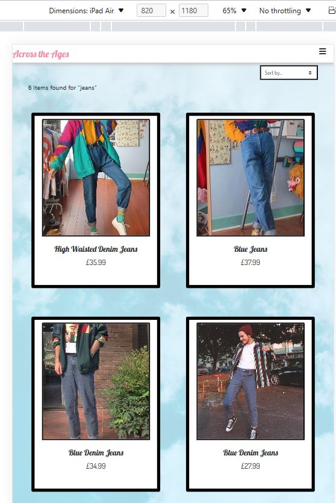
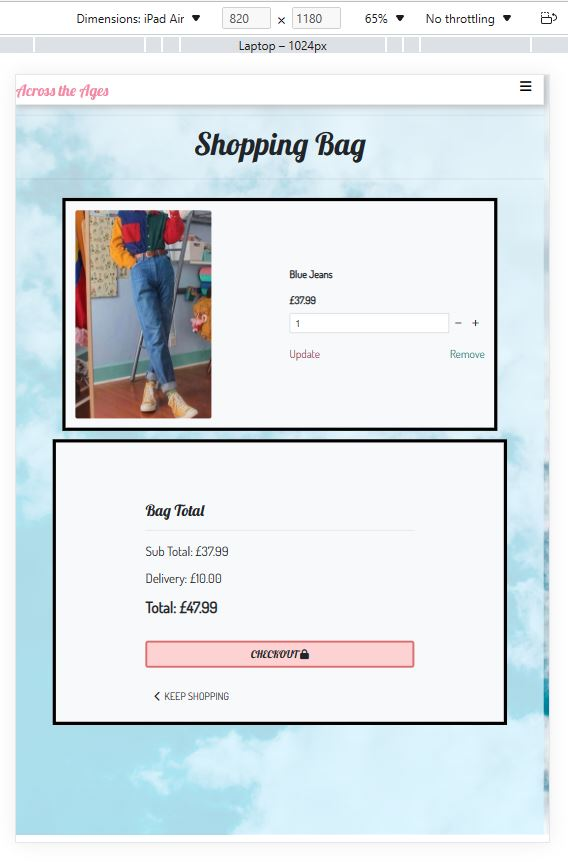

# Testing

Return back to the [README.md](README.md) file.

## Code Validation

### HTML Validation

Once I had finished my website I ran each page throigh a HTML validator to ensure that the code was correct.

| Page                               | Validation Result                                     |
| :----:                             |    :----:                                                                              | 
| Login Page Validator               |  |
| Signup Page Validator              |  |
| Profile Page Validator             | |
| Home Page Validator                |  |
| Product Result Page Validator      |  |
| Product View Page Validator        | |
| Shopping Bag Validator             |  |
| Checkout Page Validator            | |
| Checkout Success Page Validator    |  |
| Product management Page Validator  |  |
| Edit Product Page Validator        | |

### CSS Validation

I ran my CSS through a validator to ensure that it was correct. It passed the validation and came back with no errors.

#### Main App CSS

#### Profile App CSS

### PEP8 Validation 
I ran each of the python files in each app through a PEP8 validator to make sure there were no errors

#### Main App

#### Bag App

#### Checkout App

#### Home App

#### Products App

#### Profiles App

### JavaScript Validation 

## Browser Compatibility and Responsiveness 

### Register Page

| Browser        | Screen Size | Image |
| :----:         |    :----:   | :----:|
| Chrome         | Desktop     | | 
| Firefox        | Desktop     | |
| Microsoft Edge | Desktop     | |
|                |             | |
| Chrome         | Tablet      | | 
| Firefox        | Tablet      | |
| Microsoft Edge | Tablet      | |
|                |             | |
| Chrome         | Mobile      | | 
| Firefox        | Mobile      | |
| Microsoft Edge | Mobile      | |
|                |             | |

### Login Page

| Browser        | Screen Size | Image |
| :----:         |    :----:   | :----:|
| Chrome         | Desktop     | | 
| Firefox        | Desktop     | |
| Microsoft Edge | Desktop     | |
|                |             | |
| Chrome         | Tablet      | | 
| Firefox        | Tablet      | |
| Microsoft Edge | Tablet      | |
|                |             | |
| Chrome         | Mobile      | | 
| Firefox        | Mobile      | |
| Microsoft Edge | Mobile      | |
|                |             | |

### Profile Page

| Browser        | Screen Size | Image |
| :----:         |    :----:   | :----:|
| Chrome         | Desktop     | | 
| Firefox        | Desktop     | |
| Microsoft Edge | Desktop     | |
|                |             | |

### Home Page

| Browser        | Screen Size | Image |
| :----:         |    :----:   | :----:|
| Chrome         | Desktop     | | 
| Firefox        | Desktop     | |
| Microsoft Edge | Desktop     | |
|                |             | |
| Chrome         | Tablet      | | 
| Firefox        | Tablet      | |
| Microsoft Edge | Tablet      | |
|                |             | |
| Chrome         | Mobile      | | 
| Firefox        | Mobile      | |
| Microsoft Edge | Mobile      | |

### Product Results Page

| Browser        | Screen Size | Image |
| :----:         |    :----:   | :----:|
| Chrome         | Desktop     | | 
| Firefox        | Desktop     | |
| Microsoft Edge | Desktop     | |
|                |             | |
| Chrome         | Tablet      | | 
| Firefox        | Tablet      | |
| Microsoft Edge | Tablet      | |
|                |             | |
| Chrome         | Mobile      | | 
| Firefox        | Mobile      | |
| Microsoft Edge | Mobile      | |
|                |             | |

### Product View Page

| Browser        | Screen Size | Image |
| :----:         |    :----:   | :----:|
| Chrome         | Desktop     | | 
| Firefox        | Desktop     | |
| Microsoft Edge | Desktop     | |
|                |             | |
| Chrome         | Tablet      | | 
| Firefox        | Tablet      | |
| Microsoft Edge | Tablet      | |
|                |             | |
| Chrome         | Mobile      | | 
| Firefox        | Mobile      | |
| Microsoft Edge | Mobile      | |
|                |             | |

### Shopping Bag Page

| Browser        | Screen Size | Image |
| :----:         |    :----:   | :----:|
| Chrome         | Desktop     | | 
| Firefox        | Desktop     | |
| Microsoft Edge | Desktop     | |
|                |             | |
| Chrome         | Tablet      | | 
| Firefox        | Tablet      | |
| Microsoft Edge | Tablet      | |
|                |             | |
| Chrome         | Mobile      | | 
| Firefox        | Mobile      | |
| Microsoft Edge | Mobile      | |
|                |             | |

### Checkout Page

| Browser        | Screen Size | Image |
| :----:         |    :----:   | :----:|
| Chrome         | Desktop     | | 
| Firefox        | Desktop     | |
| Microsoft Edge | Desktop     | |
|                |             | |
| Chrome         | Tablet      | | 
| Firefox        | Tablet      | |
| Microsoft Edge | Tablet      | |
|                |             | |
| Chrome         | Mobile      | | 
| Firefox        | Mobile      | |
| Microsoft Edge | Mobile      | |

## Lighthouse Audit

Use this space to discuss testing the live/deployed site's Lighthouse Audit reports.
Avoid testing the local version (especially if developing in Gitpod), as this can have knock-on effects of performance.

If you don't have Lighthouse in your Developer Tools,
it can be added as an [extension](https://chrome.google.com/webstore/detail/lighthouse/blipmdconlkpinefehnmjammfjpmpbjk).

Don't just test the home page (unless it's a single-page application).
Make sure to test the Lighthouse Audit results for all of your pages.

**IMPORTANT**: You must provide screenshots of the results, to "prove" that you've actually tested them.

Sample Lighthouse testing documentation:

I've tested my deployed project using the Lighthouse Audit tool to check for any major issues.

| Page | Size | Screenshot | Notes |
| --- | --- | --- | --- |
| Home | Mobile |  | Some minor warnings |
| Home | Desktop |  | Few warnings |
| About | Mobile |  | Some minor warnings |
| About | Desktop |  | Few warnings |
| Gallery | Mobile |  | Slow response time due to large images |
| Gallery | Desktop |  | Slow response time due to large images |
| x | x | x | repeat for any other tested pages/sizes |

## Defensive Programming

Throughout the project I used defensive programing to stop users being able to preform actions that they shouldnt be able to which could cause errors within the site.

Defensive programming was manually tested with the below user acceptance testing:

| Page | User Action | Expected Result | Pass/Fail | Comments |
| --- | --- | --- | --- | --- |
| Home Page | | | | |
| | Click on Logo | Redirection to Home page | Pass | |
| | Click on Home link in navbar | Redirection to Home page | Pass | |
| | Enter word in search bar | Redirect to page displaying search results | Pass | |
| Newsletter form | | | | |
| | Submit empty form |Error displays notifing user to enter valid email | Pass | |
| | Submit form | Message appears saying form was successfuly submited | Pass | |
| Contact form | | | | |
| | Submit empty form |Error displays notifing user to enter valid email | Pass | |
| | Enter first/last name | Field will accept freeform text | Pass | |
| | Enter valid email address | Field will only accept email address format | Pass | |
| | Enter message in textarea | Field will accept freeform text | Pass | |
| | Submit form | Message appears saying form was successfuly submited | Pass | |
| Product Results | | | | |
| | Click on a product | Takes you to product view page | Pass | |
| | Sort results selector | Sort function works adjusting how the products are displayed | Pass | |
| Sign Up | | | | |
| | Click on Sign Up button | Redirection to Sign Up page | Pass | |
| | Enter valid email address | Field will only accept email address format | Pass | |
| | Enter valid password (twice) | Field will only accept password format | Pass | |
| | Click on Sign Up button | Asks user to confirm email page | Pass | Email sent to user |
| | Confirm email | Redirects user to blank Sign In page | Pass | |
| Log In | | | | |
| | Click on the Login link | Redirection to Login page | Pass | |
| | Enter valid email address | Field will only accept email address format | Pass | |
| | Enter valid password | Field will only accept password format | Pass | |
| | Click Login button | Redirects user to home page | Pass | |
| Log Out | | | | |
| | Click Logout button | Redirects user to logout page | Pass | Confirms logout first |
| | Click Confirm Logout button | Redirects user to home page | Pass | |
| Profile | | | | |
| | Click on Profile button | User will be redirected to the Profile page | Pass | |
| | Click on the Edit button | User will be redirected to the edit profile page | Pass | |
| | Click on the My Orders link | User will be redirected to the My Orders page | Pass | |
| | Brute forcing the URL to get to another user's profile | User should be given an error | Pass | Redirects user back to own profile |

## User Story Testing

| User Story:                                               | As a user I want to be able to view product                                   |        | 
| :----:                                                    | :----:                                                                        | :----: |
| Expected Outcome                                          | ScreenShot                                                                    | Result |
| When a user clicks on an item it brings up the details    |             | Pass   |

| User Story:                                               | As a user I want to be able to search products                                |        | 
| :----:                                                    | :----:                                                                        | :----: |
| Expected Outcome | ScreenShot                                                                                                             | Result |
| Users can easily type terms into a search bar             |             | Pass   |
| After searching the relevent items are displayed          |             | Pass   |

| User Story:                                               | As a user I want to be able to add items to my bag                            |        | 
| :----:                                                    | :----:                                                                        | :----: |
| Expected Outcome | ScreenShot                                                                                                             | Result |
| Notification pops up when user adds item to bag          |                      | Pass   |
| If user clicks add to bag item appears in back           |                      | Pass   |

| User Story:                                               | As a user I want to be able create a profile                                  |        | 
| :----:                                                    | :----:                                                                        | :----: |
| Expected Outcome | ScreenShot                                                                    | Result |
| Form displays error if user inputs information in wrong    |    | Pass   |
| once account is created it takes the user to their profile |    | Pass   |

| User Story:                                               | As a user I want to be able to view purcahse history                          |        | 
| :----:                                                    | :----:                                                                        | :----: |
| Expected Outcome | ScreenShot                                                                                                             | Result |
| When the user clicks on their profile they can see a list of past orders |    | Pass   |
| When the user clicks on the order number it displays their order         |    | Pass   |

| User Story:                                               | As a user I want to be able to view suggested products                              |        | 
| :----:                                                    | :----:                                                                              | :----: |
| Expected Outcome | ScreenShot                                                                                                                   | Result |
| When a user clicks on a product the listing should show similar products to them |   | Pass   |
| When a user clicks on a sugested product its takes them to the product page      |   | Pass   |

| User Story:                                               | As a user I want to be able to checkout                                           |        | 
| :----:                                                    | :----:                                                                            | :----: |
| Expected Outcome | ScreenShot                                                                                                                 | Result |
| If user doesnt fill out form error shows                  |                        | Pass   |
| If user doesnt enter card detials error shows             |                        | Pass   |
| If user enters invalid card details error shows           |                        | Pass   |
| Message appears displaying successful checkout            |                        | Pass   |

| User Story:                                               | As a user I want to be update shopping cart                                       |        | 
| :----:                                                    | :----:                                                                            | :----: |
| Expected Outcome | ScreenShot                                                                                                                 | Result |
| If user clicks on add quantity icon item quantity is increased    |                    | Pass   |
| If user clicks on remove quantity icon item quantity is decreased |                    | Pass   |
| If user clicks on remove icon item is removed from basket         |                    | Pass   |

| User Story:                                               | I want to be remove items from shopping cart                                      |        | 
| :----:                                                    | :----:                                                                            | :----: |
| Expected Outcome | ScreenShot                                                                                                                 | Result |
| If user clicks on remove button item is removed from baset |                           | Pass   |

| User Story:                                               | As a user I want to be able to save shipping information                          |        | 
| :----:                                                    | :----:                                                                            | :----: |
| Expected Outcome | ScreenShot                                                                                                                 | Result |
| if user selects remember information at checkout it auto fills for future shops |     | Pass   |

## Automated Testing

I have conducted a series of automated tests on my application.

I fully acknowledge and understand that, in a real-world scenario, an extensive set of additional tests would be more comprehensive.

### Python (Unit Testing)

I have used Django's built-in unit testing framework to test the application functionality.

In order to run the tests, I ran the following command in the terminal each time:

`python3 manage.py test name-of-app `

To create the coverage report, I would then run the following commands:

`coverage run --source=name-of-app manage.py test`

`coverage report`

To see the HTML version of the reports, and find out whether some pieces of code were missing, I ran the following commands:

`coverage html`

`python3 -m http.server`

Below are the results from the various apps on my application that I've tested:

| App | File | Coverage | Screenshot |
| --- | --- | --- | --- |
| Bag | test_forms.py | 99% |  |
| Bag | test_models.py | 89% |  |
| Bag | test_urls.py | 100% |  |
| Bag | test_views.py | 71% |  |
| Checkout | test_forms.py | 99% |  |
| Checkout | test_models.py | 89% |  |
| Checkout | test_urls.py | 100% |  |
| Checkout | test_views.py | 71% |  |
| Home | test_forms.py | 99% |  |
| Home | test_models.py | 89% |  |
| Home | test_urls.py | 100% |  |
| Home | test_views.py | 71% |  |
| Products | test_forms.py | 99% |  |
| Products | test_models.py | 89% |  |
| Products | test_urls.py | 100% |  |
| Products | test_views.py | 71% |  |
| Profiles | test_forms.py | 99% |  |
| Profiles | test_models.py | 89% |  |
| Profiles | test_urls.py | 100% |  |
| Profiles | test_views.py | 71% |  |
| x | x | x | repeat for all remaining tested apps/files |

#### Unit Test Issues

Use this section to list any known issues you ran into while writing your unit tests.
Remember to include screenshots (where possible), and a solution to the issue (if known).

This can be used for both "fixed" and "unresolved" issues.

## Bugs

It's very important to document any bugs you've discovered while developing the project.
Make sure to include any necessary steps you've implemented to fix the bug(s) as well.

For JavaScript and Python applications, it's best to screenshot the errors to include them as well.

**PRO TIP**: screenshots of bugs are extremely helpful, and go a long way!

- JS Uncaught ReferenceError: `foobar` is undefined/not defined

    

    - To fix this, I _____________________.

- JS `'let'` or `'const'` or `'template literal syntax'` or `'arrow function syntax (=>)'` is available in ES6 (use `'esversion: 11'`) or Mozilla JS extensions (use moz).

    

    - To fix this, I _____________________.

- Python `'ModuleNotFoundError'` when trying to import module from imported package

    

    - To fix this, I _____________________.

- Django `TemplateDoesNotExist` at /appname/path appname/template_name.html

    

    - To fix this, I _____________________.

- Python `E501 line too long` (93 > 79 characters)

    

    - To fix this, I _____________________.

### GitHub **Issues**

An improved way to manage bugs is to use the built-in **Issues** tracker on your GitHub repository.
To access your Issues, click on the "Issues" tab at the top of your repository.
Alternatively, use this link: https://github.com/Claire221/Across-The-Ages/issues

If using the Issues tracker for your bug management, you can simplify the documentation process.
Issues allow you to directly paste screenshots into the issue without having to first save the screenshot locally,
then uploading into your project.

You can add labels to your issues (`bug`), assign yourself as the owner, and add comments/updates as you progress with fixing the issue(s).

Once you've sorted the issue, you should then "Close" it.

When showcasing your bug tracking for assessment, you can use the following format:

**Fixed Bugs**

All previously closed/fixed bugs can be tracked [here](https://github.com/Claire221/Across-The-Ages/issues?q=is%3Aissue+is%3Aclosed).

| Bug | Status |
| --- | --- |
| [JS Uncaught ReferenceError: `foobar` is undefined/not defined](https://github.com/Claire221/Across-The-Ages/issues/1) | Closed |
| [Python `'ModuleNotFoundError'` when trying to import module from imported package](https://github.com/Claire221/Across-The-Ages/issues/2) | Closed |
| [Django `TemplateDoesNotExist` at /appname/path appname/template_name.html](https://github.com/Claire221/Across-The-Ages/issues/3) | Closed |

**Open Issues**

Any remaining open issues can be tracked [here](https://github.com/Claire221/Across-The-Ages/issues).

| Bug | Status |
| --- | --- |
| [JS `'let'` or `'const'` or `'template literal syntax'` or `'arrow function syntax (=>)'` is available in ES6 (use `'esversion: 11'`) or Mozilla JS extensions (use moz).](https://github.com/Claire221/Across-The-Ages/issues/4) | Open |
| [Python `E501 line too long` (93 > 79 characters)](https://github.com/Claire221/Across-The-Ages/issues/5) | Open |

## Unfixed Bugs

You will need to mention unfixed bugs and why they were not fixed.
This section should include shortcomings of the frameworks or technologies used.
Although time can be a big variable to consider, paucity of time and difficulty understanding
implementation is not a valid reason to leave bugs unfixed.

If you've identified any unfixed bugs, no matter how small, be sure to list them here.
It's better to be honest and list them, because if it's not documented and an assessor finds the issue,
they need to know whether or not you're aware of them as well, and why you've not corrected/fixed them.

Some examples:

- On devices smaller than 375px, the page starts to have `overflow-x` scrolling.

    

    - Attempted fix: I tried to add additional media queries to handle this, but things started becoming too small to read.

- For PP3, when using a helper `clear()` function, any text above the height of the terminal does not clear, and remains when you scroll up.

    

    - Attempted fix: I tried to adjust the terminal size, but it only resizes the actual terminal, not the allowable area for text.

- When validating HTML with a semantic `section` element, the validator warns about lacking a header `h2-h6`. This is acceptable.

    

    - Attempted fix: this is a known warning and acceptable, and my section doesn't require a header since it's dynamically added via JS.

If you legitimately cannot find any unfixed bugs or warnings, then use the following sentence:

There are no remaining bugs that I am aware of.
