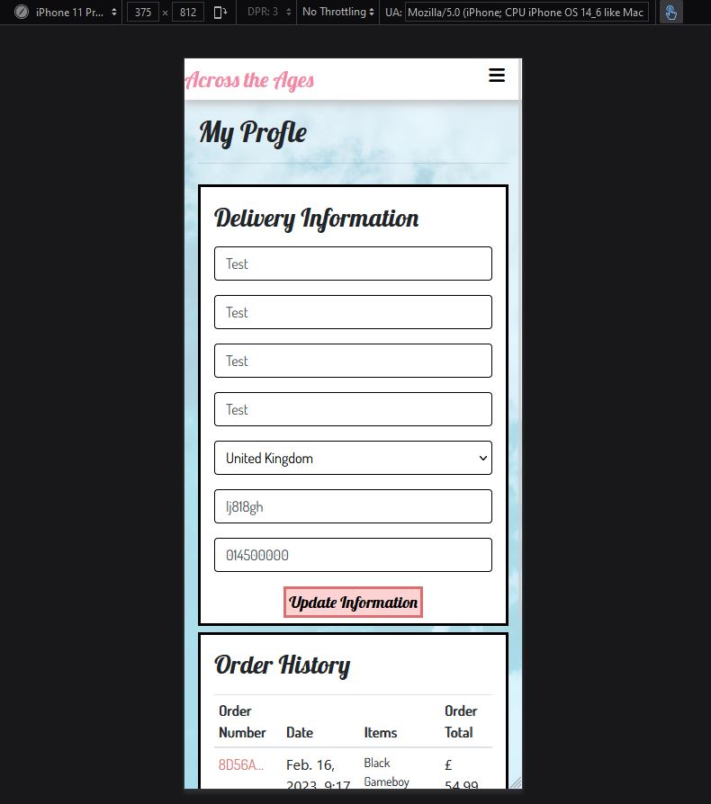
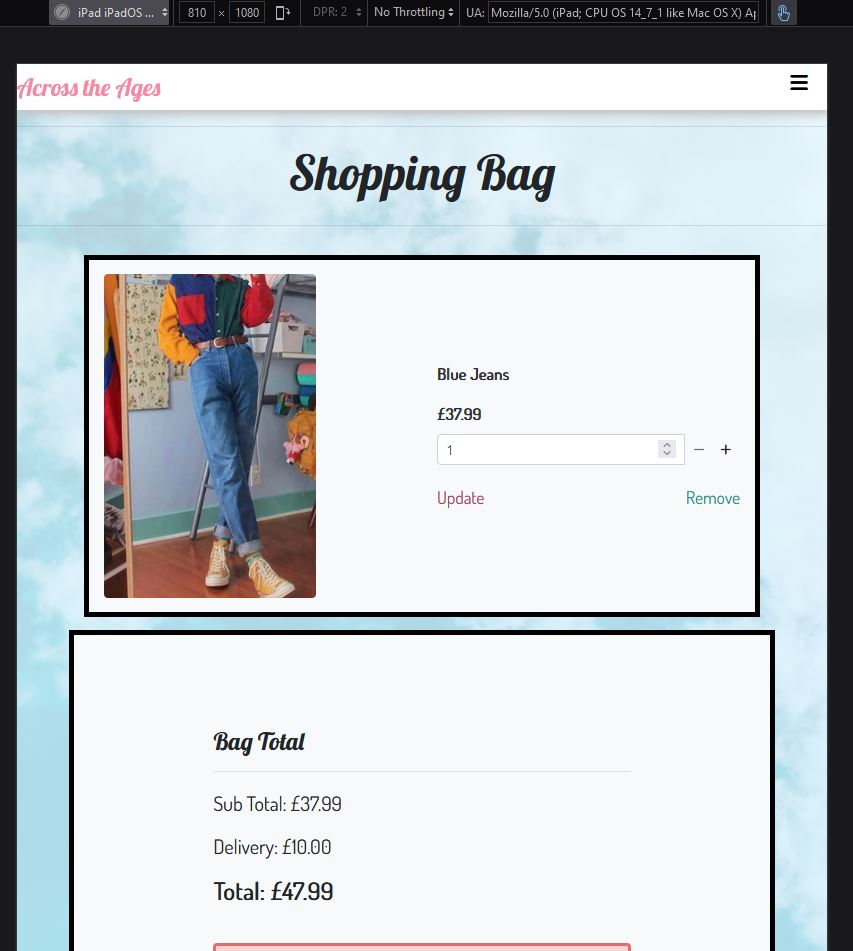
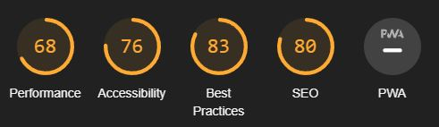

# Testing

Return back to the [README.md](README.md) file.

## Code Validation

### HTML Validation

Once I had finished my website I ran each page throigh a HTML validator to ensure that the code was correct.

| Page                               | Validation Result                                     |
| :----:                             |    :----:                                                                              | 
| Login Page Validator               |  |
| Signup Page Validator              |  |
| Profile Page Validator             | |
| Home Page Validator                |  |
| Product Result Page Validator      |  |
| Product View Page Validator        | |
| Shopping Bag Validator             |  |
| Checkout Page Validator            | |
| Checkout Success Page Validator    |  |
| Product management Page Validator  |  |
| Edit Product Page Validator        | |

### CSS Validation

I ran my CSS through a validator to ensure that it was correct. It passed the validation and came back with no errors.

#### Main App CSS

#### Profile App CSS

### PEP8 Validation 
I ran each of the python files in each app through a PEP8 validator to make sure there were no errors

#### Main App
| File           | Screenshot Size 
| :----:         |    :----:   
| Settings       | | 
| URLs           | | 
| views          | | 

#### Bag App
| File           | Screenshot Size 
| :----:         |    :----:   
| Views          | | 
| contexts       | |
| URLS           | | 

#### Checkout App
| File           | Screenshot Size 
| :----:         |    :----:   
| Views          | | 
| Admin          | | |
| Forms          | | )| 
| Models         | | )|
| WebHooks       | | )| 
| WebHooks handler| | )| 

#### Home App
| File           | Screenshot Size 
| :----:         |    :----:   
| Views          | | 
| Forms          | | 
| Models         | | 
| URLs           | | 

#### Products App
| File           | Screenshot Size 
| :----:         |    :----:   
| Views          | | 
| Forms          | |
| Models         | |
| URLs           | |

#### Profiles App
| File           | Screenshot Size 
| :----:         |    :----:   
| Views          | | 
| Models         | | 
| URLs           | | 
| Forms          | | 

### JavaScript Validation 
I ran each of my JavaScript files through a JavaJcript validator to make sure there were no errors

#### Checkout File

#### Profile File

## Browser Compatibility and Responsiveness 

### Register Page

| Browser        | Screen Size | Image |
| :----:         |    :----:   | :----:|
| Chrome         | Desktop     | | 
| Firefox        | Desktop     | |
| Microsoft Edge | Desktop     | |
|                |             | |
| Chrome         | Tablet      | | 
| Firefox        | Tablet      | |
| Microsoft Edge | Tablet      | |
|                |             | |
| Chrome         | Mobile      | | 
| Firefox        | Mobile      | |
| Microsoft Edge | Mobile      | |
|                |             | |

### Login Page

| Browser        | Screen Size | Image |
| :----:         |    :----:   | :----:|
| Chrome         | Desktop     | | 
| Firefox        | Desktop     | |
| Microsoft Edge | Desktop     | |
|                |             | |
| Chrome         | Tablet      | | 
| Firefox        | Tablet      | |
| Microsoft Edge | Tablet      | |
|                |             | |
| Chrome         | Mobile      | | 
| Firefox        | Mobile      | |
| Microsoft Edge | Mobile      | |
|                |             | |

### Profile Page

| Browser        | Screen Size | Image |
| :----:         |    :----:   | :----:|
| Chrome         | Desktop     | | 
| Firefox        | Desktop     | |
| Microsoft Edge | Desktop     | |
|                |             | |
| Chrome         | Tablet      | | 
| Firefox        | Tablet      | |
| Microsoft Edge | Tablet      | |
|                |             | |
| Chrome         | Mobile      | | 
| Firefox        | Mobile      | |
| Microsoft Edge | Mobile      | |
|                |             | |

### Home Page

| Browser        | Screen Size | Image |
| :----:         |    :----:   | :----:|
| Chrome         | Desktop     | | 
| Firefox        | Desktop     | |
| Microsoft Edge | Desktop     | |
|                |             | |
| Chrome         | Tablet      | | 
| Firefox        | Tablet      | |
| Microsoft Edge | Tablet      | |
|                |             | |
| Chrome         | Mobile      | | 
| Firefox        | Mobile      | |
| Microsoft Edge | Mobile      | |

### Product Results Page

| Browser        | Screen Size | Image |
| :----:         |    :----:   | :----:|
| Chrome         | Desktop     | | 
| Firefox        | Desktop     | |
| Microsoft Edge | Desktop     | |
|                |             | |
| Chrome         | Tablet      | | 
| Firefox        | Tablet      | |
| Microsoft Edge | Tablet      | |
|                |             | |
| Chrome         | Mobile      | | 
| Firefox        | Mobile      | |
| Microsoft Edge | Mobile      | |
|                |             | |

### Product View Page

| Browser        | Screen Size | Image |
| :----:         |    :----:   | :----:|
| Chrome         | Desktop     | | 
| Firefox        | Desktop     | |
| Microsoft Edge | Desktop     | |
|                |             | |
| Chrome         | Tablet      | | 
| Firefox        | Tablet      | |
| Microsoft Edge | Tablet      | |
|                |             | |
| Chrome         | Mobile      | | 
| Firefox        | Mobile      | |
| Microsoft Edge | Mobile      | |
|                |             | |

### Shopping Bag Page

| Browser        | Screen Size | Image |
| :----:         |    :----:   | :----:|
| Chrome         | Desktop     | | 
| Firefox        | Desktop     | |
| Microsoft Edge | Desktop     | |
|                |             | |
| Chrome         | Tablet      | | 
| Firefox        | Tablet      | |
| Microsoft Edge | Tablet      | |
|                |             | |
| Chrome         | Mobile      | | 
| Firefox        | Mobile      | |
| Microsoft Edge | Mobile      | |
|                |             | |

### Checkout Page

| Browser        | Screen Size | Image |
| :----:         |    :----:   | :----:|
| Chrome         | Desktop     | | 
| Firefox        | Desktop     | |
| Microsoft Edge | Desktop     | |
|                |             | |
| Chrome         | Tablet      | | 
| Firefox        | Tablet      | |
| Microsoft Edge | Tablet      | |
|                |             | |
| Chrome         | Mobile      | | 
| Firefox        | Mobile      | |
| Microsoft Edge | Mobile      | |

## Lighthouse Audit

I've tested each page of my deployed project using the Lighthouse Audit tool to check for any major issues.

| Page | Size | Screenshot | Notes |
| --- | --- | --- | --- |
| Home | Mobile |  | Few warnings |
| Home | Desktop |  | Few warnings |
| Profile | Mobile |  | Few warnings |
| Profile | Desktop |  | Few warnings |
| Product Results | Mobile |  | Few warnings |
| Product Results | Desktop |  | Some minor warnings |
| Product View | Mobile |  | Some minor warnings |
| Product View | Desktop |  | Some minor warnings |
| Bag | Mobile |  | Some minor warnings |
| Bag | Desktop |  | Some minor warnings |
| Checkout | Mobile |  | Few warnings |
| Checkout | Desktop |  | Few warnings |

## Defensive Programming

Throughout the project I used defensive programing to stop users being able to preform actions that they shouldnt be able to which could cause errors within the site.

Defensive programming was manually tested with the below user acceptance testing:

| Page | User Action | Expected Result | Pass/Fail | Comments |
| --- | --- | --- | --- | --- |
| Home Page | | | | |
| | Click on Logo | Redirection to Home page | Pass | |
| | Click on Home link in navbar | Redirection to Home page | Pass | |
| | Enter word in search bar | Redirect to page displaying search results | Pass | |
| Newsletter form | | | | |
| | Submit empty form |Error displays notifing user to enter valid email | Pass | |
| | Submit form | Message appears saying form was successfuly submited | Pass | |
| Contact form | | | | |
| | Submit empty form |Error displays notifing user to enter valid email | Pass | |
| | Enter first/last name | Field will accept freeform text | Pass | |
| | Enter valid email address | Field will only accept email address format | Pass | |
| | Enter message in textarea | Field will accept freeform text | Pass | |
| | Submit form | Message appears saying form was successfuly submited | Pass | |
| Product Results | | | | |
| | Click on a product | Takes you to product view page | Pass | |
| | Sort results selector | Sort function works adjusting how the products are displayed | Pass | |
| Sign Up | | | | |
| | Click on Sign Up button | Redirection to Sign Up page | Pass | |
| | Enter valid email address | Field will only accept email address format | Pass | |
| | Enter valid password (twice) | Field will only accept password format | Pass | |
| | Click on Sign Up button | Asks user to confirm email page | Pass | Email sent to user |
| | Confirm email | Redirects user to blank Sign In page | Pass | |
| Log In | | | | |
| | Click on the Login link | Redirection to Login page | Pass | |
| | Enter valid email address | Field will only accept email address format | Pass | |
| | Enter valid password | Field will only accept password format | Pass | |
| | Click Login button | Redirects user to home page | Pass | |
| Log Out | | | | |
| | Click Logout button | Redirects user to logout page | Pass | Confirms logout first |
| | Click Confirm Logout button | Redirects user to home page | Pass | |
| Profile | | | | |
| | Click on Profile button | User will be redirected to the Profile page | Pass | |
| | Click on the Edit button | User will be redirected to the edit profile page | Pass | |
| | Click on the My Orders link | User will be redirected to the My Orders page | Pass | |
| | Brute forcing the URL to get to another user's profile | User should be given an error | Pass | Redirects user back to own profile |

## User Story Testing

| User Story:                                               | As a user I want to be able to view product                                   |        | 
| :----:                                                    | :----:                                                                        | :----: |
| Expected Outcome                                          | ScreenShot                                                                    | Result |
| When a user clicks on an item it brings up the details    |             | Pass   |

| User Story:                                               | As a user I want to be able to search products                                |        | 
| :----:                                                    | :----:                                                                        | :----: |
| Expected Outcome | ScreenShot                                                                                                             | Result |
| Users can easily type terms into a search bar             |             | Pass   |
| After searching the relevent items are displayed          |             | Pass   |

| User Story:                                               | As a user I want to be able to add items to my bag                            |        | 
| :----:                                                    | :----:                                                                        | :----: |
| Expected Outcome | ScreenShot                                                                                                             | Result |
| Notification pops up when user adds item to bag          |                      | Pass   |
| If user clicks add to bag item appears in back           |                      | Pass   |

| User Story:                                               | As a user I want to be able create a profile                                  |        | 
| :----:                                                    | :----:                                                                        | :----: |
| Expected Outcome | ScreenShot                                                                    | Result |
| Form displays error if user inputs information in wrong   |    | Pass   |

| User Story:                                               | As a user I want to be able to view purcahse history                          |        | 
| :----:                                                    | :----:                                                                        | :----: |
| Expected Outcome | ScreenShot                                                                                                             | Result |
| When the user clicks on their profile they can see a list of past orders |    | Pass   |
| When the user clicks on the order number it displays their order         |     | Pass   |

| User Story:                                               | As a user I want to be able to view suggested products                              |        | 
| :----:                                                    | :----:                                                                              | :----: |
| Expected Outcome | ScreenShot                                                                                                                   | Result |
| When a user clicks on a product the listing should show similar products to them |   | Pass   |
| When a user clicks on a sugested product its takes them to the product page      |   | Pass   |

| User Story:                                               | As a user I want to be able to checkout                                           |        | 
| :----:                                                    | :----:                                                                            | :----: |
| Expected Outcome | ScreenShot                                                                                                                 | Result |
| If user doesnt fill out form error shows                  |                        | Pass   |
| If user doesnt enter card detials error shows             |                        | Pass   |
| If user enters invalid card details error shows           |                        | Pass   |
| Message appears displaying successful checkout            |                        | Pass   |

| User Story:                                               | As a user I want to be update shopping cart                                       |        | 
| :----:                                                    | :----:                                                                            | :----: |
| Expected Outcome | ScreenShot                                                                                                                 | Result |
| If user clicks on add quantity icon item quantity is increased    |                    | Pass   |
| If user clicks on remove quantity icon item quantity is decreased |                    | Pass   |
| If user clicks on remove icon item is removed from basket         |                    | Pass   |

| User Story:                                               | I want to be remove items from shopping cart                                      |        | 
| :----:                                                    | :----:                                                                            | :----: |
| Expected Outcome | ScreenShot                                                                                                                 | Result |
| If user clicks on remove button item is removed from baset |                           | Pass   |

| User Story:                                               | As a user I want to be able to save shipping information                          |        | 
| :----:                                                    | :----:                                                                            | :----: |
| Expected Outcome | ScreenShot                                                                                                                 | Result |
| if user selects remember information at checkout it auto fills for future shops |     | Pass   |

